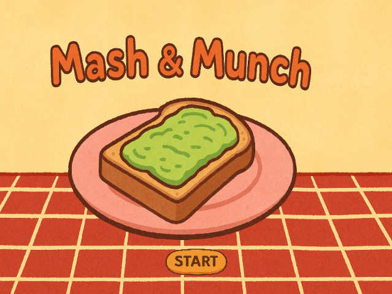
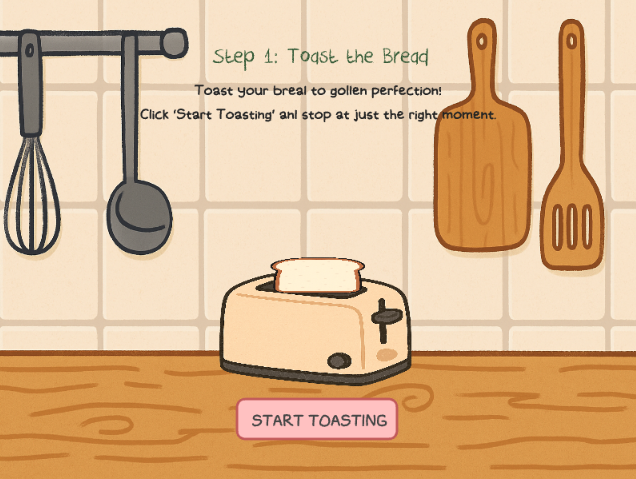
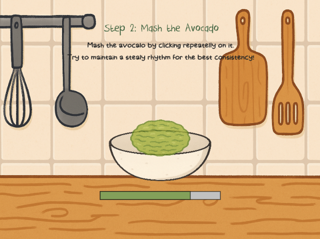
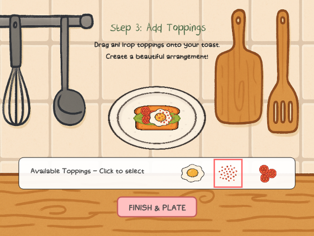

# 🥑 Mash & Munch 🍞: The Avocado Toast Game

## Personal Information
- **Name:** Heeji Kim
- **ID:** 20244197
- **Email:** jolieheejikim@kaist.ac.kr

## Project Links
- **Repository:** https://github.com/joliekim/avocado-toast
- **Video Demo:** https://youtu.be/xoB5fdas1GY

## Game Description

Mash & Munch is an **interactive cooking game** where players create the perfect avocado toast through a series of mini-games. The game challenges players to master each step of the avocado toast preparation process, from toasting bread to arranging toppings.




### Gameplay

The game consists of four main stages:

1. **Toast the Bread**: Players must toast the bread to golden perfection by starting and stopping the toaster at just the right moment. Too little time results in undercooked bread, while too much creates burnt toast.

2. **Mash the Avocado**: Players repeatedly click on the avocado to mash it to the ideal consistency. A steady rhythm produces the smoothest result.

3. **Add Toppings**: Players drag and drop various toppings (egg, chili, tomato) onto their toast to create a beautiful arrangement.

4. **See Results**: The final creation is scored based on the quality of each step, giving players a total score out of 100.

<br>






### Controls
- **Mouse clicks** for interactions like starting/stopping toasting, mashing avocado, and selecting toppings
- **Drag and drop** for placing and arranging toppings


## Code Organization

The game is built using p5.js for rendering and interaction, with a modular, scene-based architecture that follows object-oriented programming principles.

### Architecture Diagram

```
┌─────────────────────────────┐
│           sketch.js         │
│  (Main Game Initialization) │
└───────────────┬─────────────┘
                │
                ▼
┌─────────────────────────────┐
│        gameManager.js       │
│     (State Management)      │
└───────────────┬─────────────┘
                │
                ▼
┌─────────────────────────────┐
│          scenes.js          │
│    (Game Scene Classes)     │
└─────────────────────────────┘
```

### Key Components

#### Scene Class System
The game uses a base `Scene` class that provides common functionality, with specific scenes inheriting from it:

- **Scene** (Base class)
  - **InstructionsScene** (Instructions and game start)
  - **ToastScene** (Bread toasting mini-game)
  - **MashScene** (Avocado mashing mini-game)
  - **ToppingsScene** (Topping arrangement mini-game)
  - **ResultsScene** (Final score display)

Each scene handles its own rendering, user interactions, and game logic.

#### GameManager
The `GameManager` class orchestrates the game flow, managing:
- Current scene transitions
- Game state across scenes
- Score tracking for each mini-game
- Overall game progress

#### Asset Management
The game preloads all necessary assets (images, fonts, sounds) to ensure smooth gameplay. Custom fonts (Harley Smith for body text and Crayon Crumble for headings) enhance the visual identity.

### File Structure

| File | Purpose |
|------|---------|
| **index.html** | Main HTML file that loads the p5.js library, custom fonts, and game scripts |
| **style.css** | CSS styling for the HTML elements and custom font definitions |
| **sketch.js** | Main p5.js entry point that handles setup, draw loop, and asset loading |
| **gameManager.js** | Manages game state, scene transitions, and score tracking |
| **scenes.js** | Contains all scene classes that implement the different game stages |

### Interaction Flow

The game implements several interaction patterns:
- **Observer Pattern**: The game manager observes scene changes and updates accordingly
- **State Pattern**: Different scenes represent different states of the game
- **Command Pattern**: Button callbacks encapsulate actions to be executed

When a player completes the toasting mini-game:
1. The `ToastScene` evaluates the toast quality
2. The quality score is stored in the `GameManager`
3. The "LET'S MASH" button appears
4. When clicked, `GameManager.changeScene('mash')` is called
5. The game transitions to the `MashScene`

## Features and Challenges

### Special Features
- **Responsive UI** with custom fonts for enhanced visual appeal
- **Visual feedback** during interactions (bread browning, avocado mashing effects)
- **Score system** that evaluates performance across multiple dimensions

### Known Issues
- Incomplete game logic for the final stage
- Insufficient game content and variety

## Resources and Acknowledgments

- **Libraries**:
  - [p5.js](https://p5js.org/) for rendering and interaction

- **Assets**:
  - Custom fonts: Harley Smith (body text) and Crayon Crumble (headings)
  - Sounds from [Pixabay](https://pixabay.com/)

- **References**:
  - [p5.js](https://archive.p5js.org/reference/) documentation
  - Cursor for development support
  - ChatGPT for image generation

## Development Process

The development followed these steps:
1. **Planning**: Designed the game concept and identified the key mini-games
2. **Architecture Design**: Created the scene-based structure and game flow
3. **Asset Gathering**: Collected and created necessary visual and audio assets
4. **Implementation**: Built each mini-game and integrated them
5. **Testing and Refinement**: Make minor adjustments
6. **Documentation**: Created this README page

<br>

---

*This game was developed as a project for [ID311] at KAIST.*
